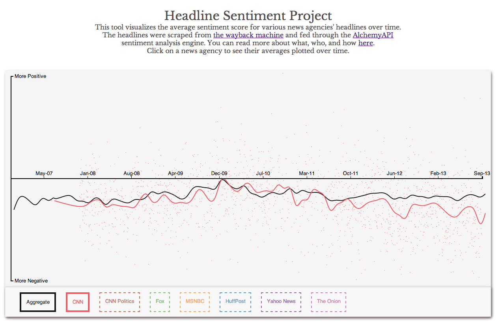
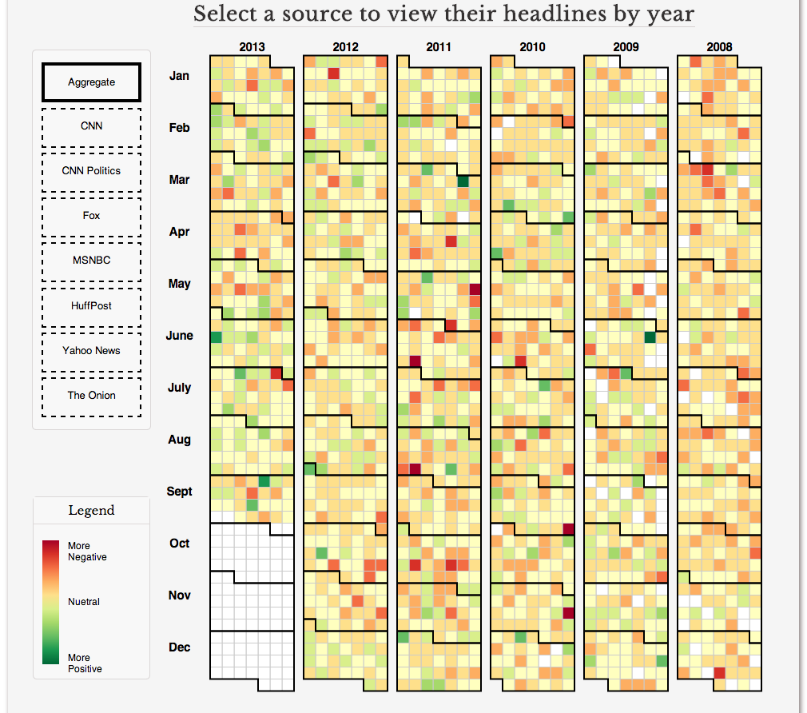
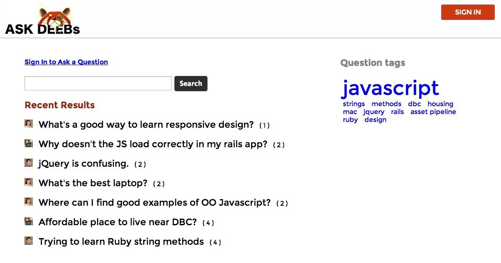
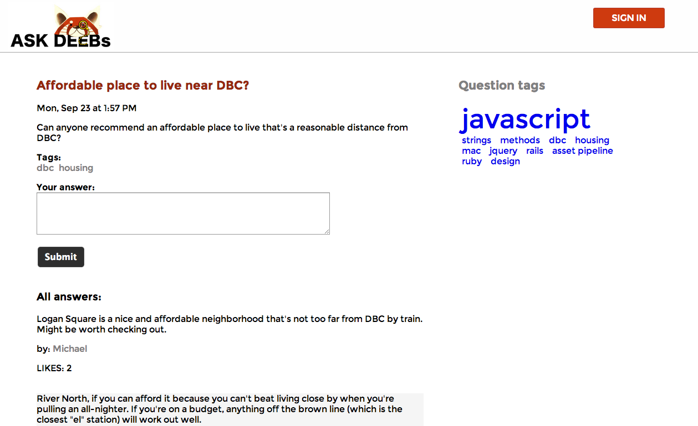
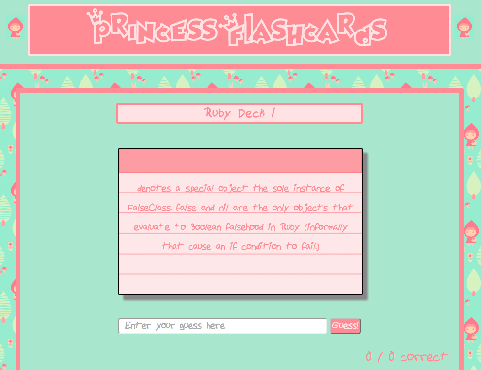



#### Welcome to my web site.  The purpose of this site is to showcase projects I have worked on, projects I'm currently working on, and interesting technology I want to explore.

<!-- 
<ul class="posts">
  
    <li>{{ post.date | date_to_string }} &raquo; <a href="{{ BASE_PATH }}{{ post.url }}">{{ post.title }}</a></li>
  
</ul>
 -->

***
***
***

###[Sentiment Analysis Project](http://headlines-and-data.herokuapp.com/)
This was my final project at Dev Bootcamp and had 3 main components to it: scraping news headlines, getting sentiment analysis scores for those headlines and then dispaying this data.

* In order to source the headlines we used the [Wayback Machine](http://archive.org/web/).  We got lucky and found a ruby gem that would grab all of the pages in the wayback archive for each news source we used.  We started with CNN, Fox News, and MSNBC.  After grabbing all of the pages, we used Nokogiri to scrape each page one at a time, and grabbed everything we thought might be a news headline. 
* Once we had the headlines we needed to run them through some kind of sentiment analysis engine.  We settled on [Alchemy](http://www.alchemyapi.com/) since they were kind enough to let us do 30,000 API calls a day (for free).
* We then took all of these data, the headlines and their respective analyses, and populated our PostgreSQL database, through ActiveRecord, using the Ruby on Rails platform for all of the backend.  Our landing page loadtime was unacceptably slow at first (~1 minute for loading all of the sentiment data to our front-end), but after optimizing the ActiveRecord queries, and then caching everything with memcache, we were getting 1ms load times.
* All of the front-end work was using the [D3 JavaScript library](http://d3js.org/).  There were several beatiful ways of displaying this data, and we settled on 2: a scatter plot of all of the data, with a line-graph to show the monthly averages, and a more in-depth calendar view where you could view the headlines from our database, their sentiment scores, and a link back to the archived page on the Wayback Machine.

***
***
***

###[AskDeebs](http://askdeebs.herokuapp.com/)
The idea of this project was to create a Stack Overflow-ish website specifically for Dev Bootcamp students and staff.  Every day students toil away searching the internet for the best answer to a question, or an instructor or other staff member sends out an email with a link to a good bit of knowledge, but that knowledge is not aggregated for the good of all at Dev Bootcamp.  This Ruby on Rails project was an attempt to fix that problem.  Our team used Dev Bootcamp's authentication existing Oauth, and allows for up-voting and down-voting best responses to questions.  Anyone can browse, but only Oauth authenticated users can actually post questions or answers.

***
***
***
###[Princess Flashcards](https://github.com/kelmerp/web-flashcards)
Fun, flashcard Sinatra app project.  Bright pinks and pastels.  We had a blast with this one.  

